# Myanmar Food Price Analysis

Comprehensive exploration of WFP market monitoring data for Myanmar, focusing on inflation, regional disparities, and commodity-specific dynamics.

## Dataset
- Rows: 38,629 | Columns: 24
- Markets tracked: 264 | Commodities: 17
- Date range: 2008-01-15 to 2025-09-15
- Fields standardized: commodity, category, unit, admin names; numeric types for price/usdprice/lat/long.

## Quick Stats
|       |    price |    usdprice |
|:------|---------:|------------:|
| count | 38629    | 38629       |
| mean  |  2313.08 |     1.36938 |
| std   |  2659.6  |     1.46372 |
| min   |     3    |     0.002   |
| 25%   |   687    |     0.48    |
| 50%   |  1515.15 |     0.97    |
| 75%   |  2809    |     1.65    |
| max   | 60000    |    50.63    |

Top monitored commodities:
| commodity_clean   |   count |
|:------------------|--------:|
| Rice              |    6892 |
| Salt              |    6052 |
| Palm Oil          |    4877 |
| Pulses            |    4869 |
| Onions            |    4016 |
| Eggs              |    3628 |
| Tomatoes          |    2924 |
| Fuel              |    1197 |
| Wage              |    1175 |
| Chickpeas         |    1051 |

Most active markets:
| market_clean          |   count |
|:----------------------|--------:|
| Lashio Market         |     769 |
| Buthidaung            |     618 |
| Hakha Myoma Market    |     569 |
| Pakokku Myo Ma Market |     567 |
| Kutkai                |     561 |
| Momauk                |     532 |
| Manton                |     507 |
| Tonzang               |     496 |
| Shwegu                |     488 |
| Magway                |     484 |

## Price Distributions
- Prices are right-skewed; USD prices mirror MMK levels, implying stable conversion in most periods.
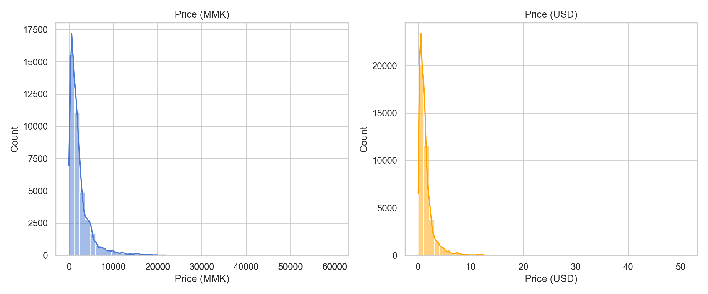

## National Trend
- Average monthly prices climb steadily with notable jumps in 2014-01: 73.1%, 2011-06: 68.9%, 2011-07: 53.1%.
- Annotated spikes flag months with outsized month-on-month changes.
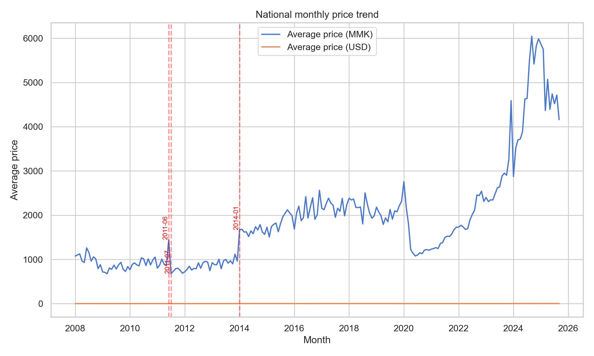

## Staple Commodities
- Rice, palm oil, onions, salt, and pulses show divergent inflation paths; oil and onions rise faster.
- Most inflationary commodities: Pulses (750% since first year), Tomatoes (561% since first year), Onions (453% since first year)
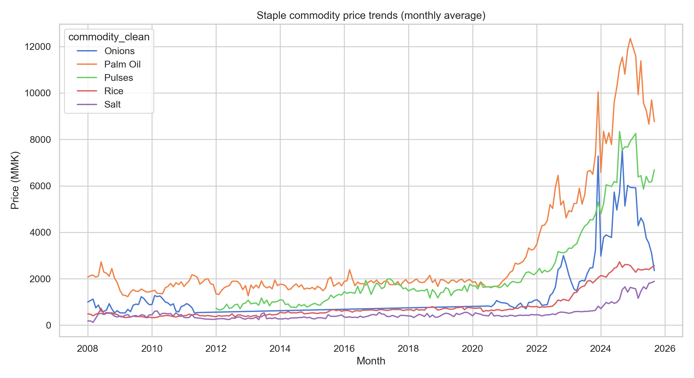

## Seasonality
- Onion prices show strong annual seasonality with peaks mid-year and dips post-harvest.
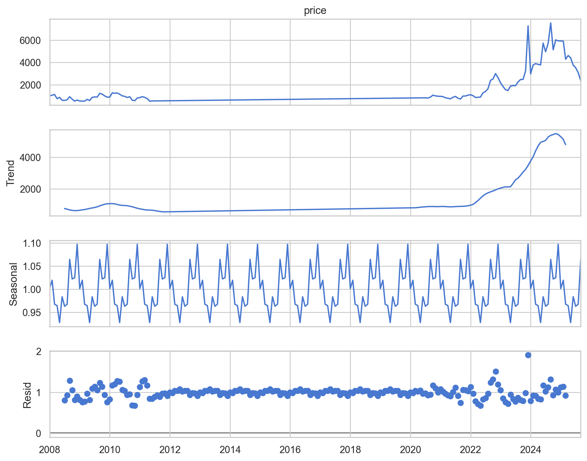

## Regional Prices
- Highest prices in Sagaing (3132 MMK), lowest in Magway.
- Heatmap contrasts states across top commodities; HTML map plots market-level prices.
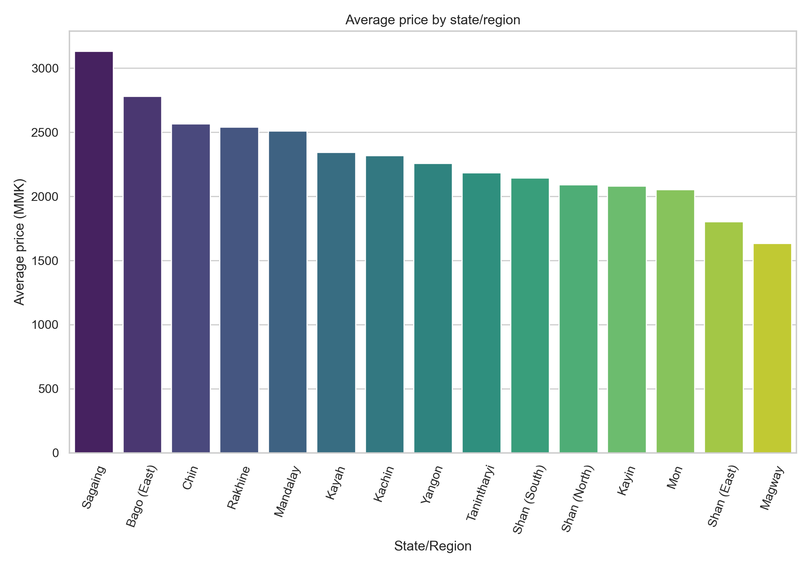
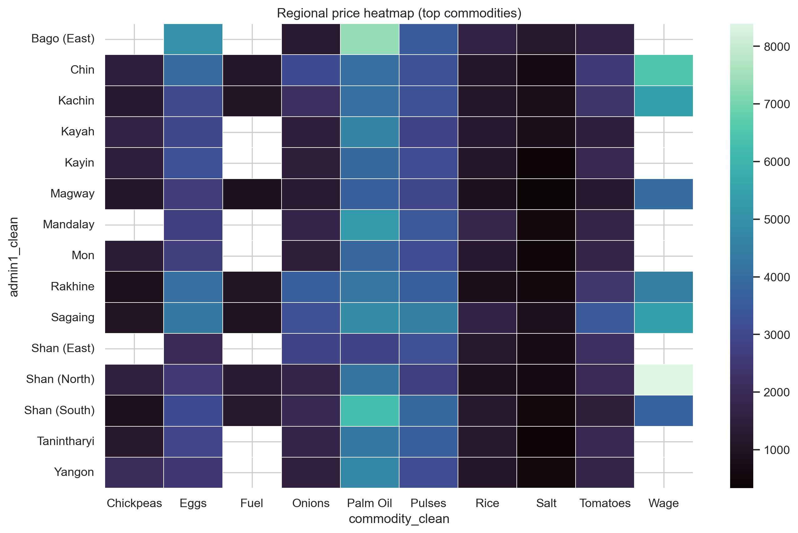

[Interactive market map](maps/market_price_map.html)

## Volatility and Shocks
- Most volatile: Onions (CV=1.30); most stable: Meat (CV=0.23).
- Detected 386 outlier records; example: Rice in Taung Bazzar on 2008-02-15 at 650 MMK (z=3.8).
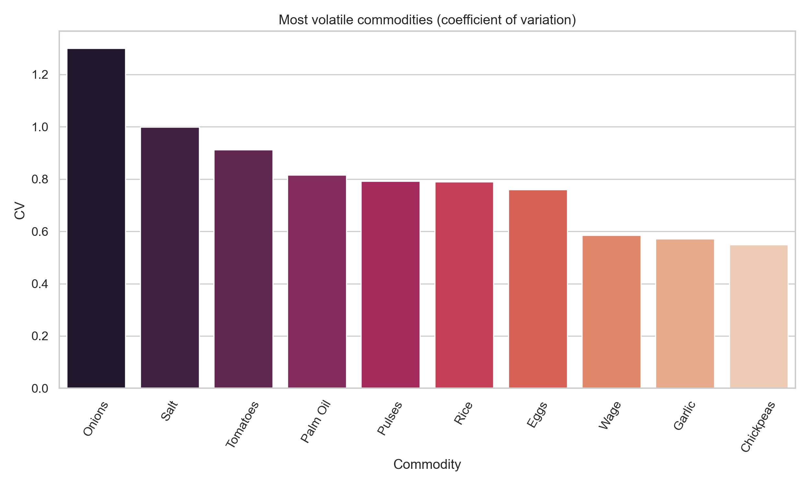

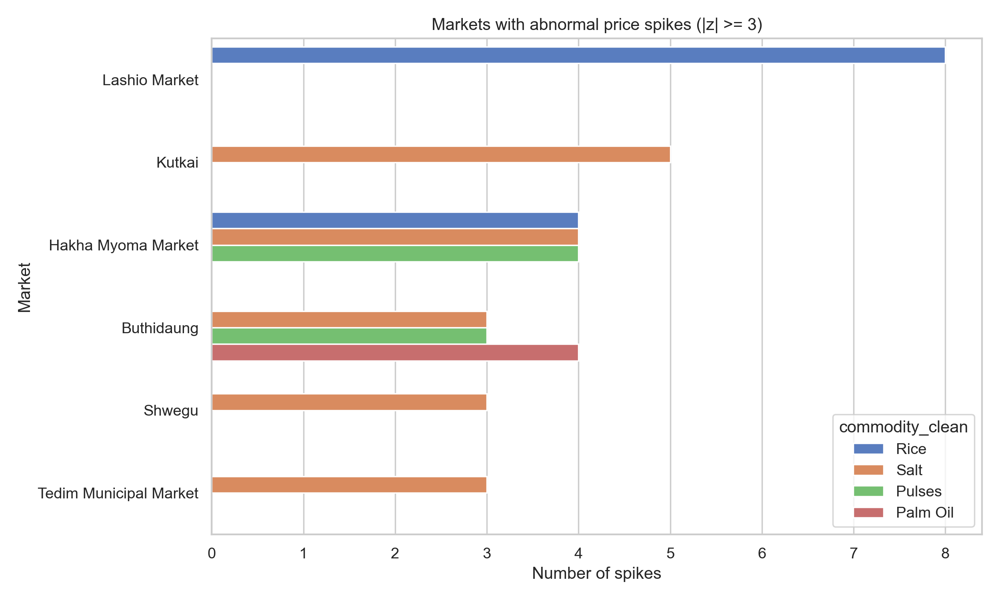

## Currency Divergence
- MMK and USD prices correlate at 0.88; divergence widens during MMK depreciation periods.
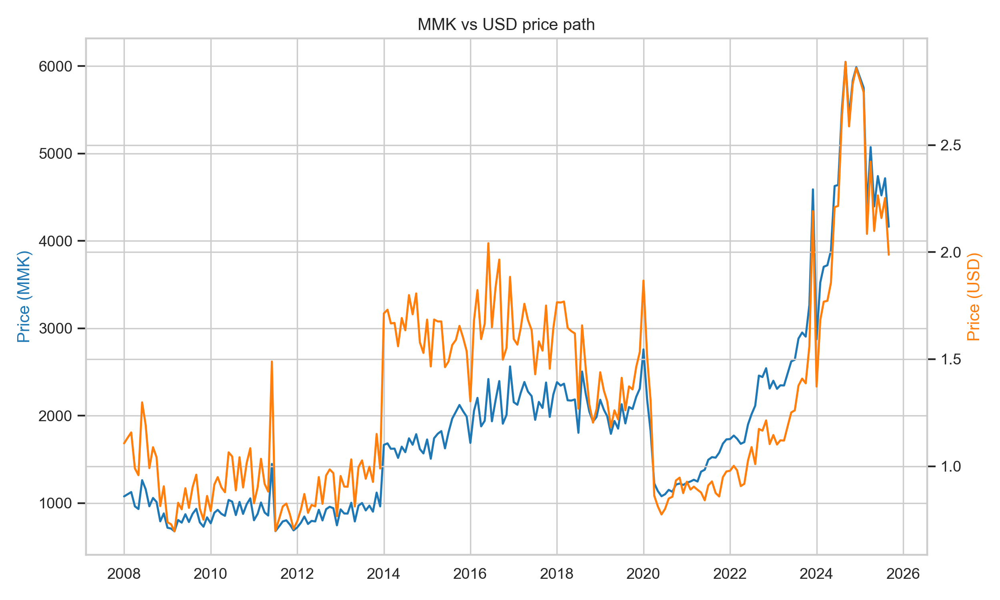

## Correlations
- Strongest commodity co-movements: Pulses–Rice (0.98), Palm Oil–Pulses (0.98), Eggs–Pulses (0.96)
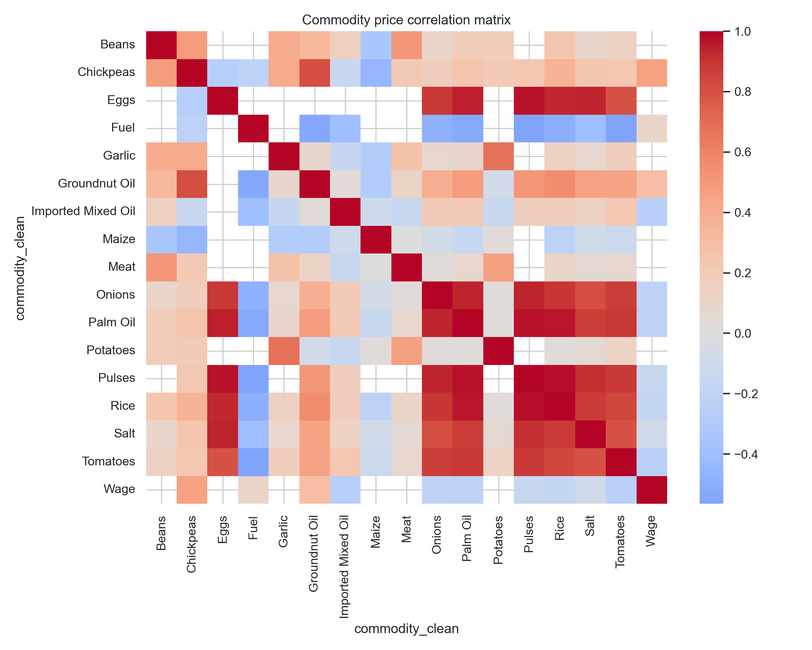

## Market Clusters
- K-means on standardized price histories groups markets into similarity clusters.
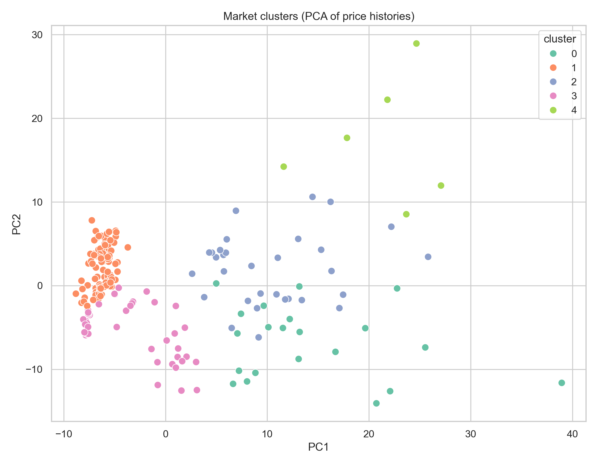

## Forecast
- Rice forecast next 6 months ranges 2285-2850 MMK; trajectory stays above recent mean.

## Recommendations
- Target onion and oil supply chains in high-volatility months; pre-position stocks before seasonal spikes.
- Monitor northern states with consistently higher price levels to prioritize cash or voucher support.
- Track MMK depreciation periods where USD prices stay flat but local prices surge to adjust transfer values.
- Use market clusters to stage surveys in representative hubs instead of every market.
